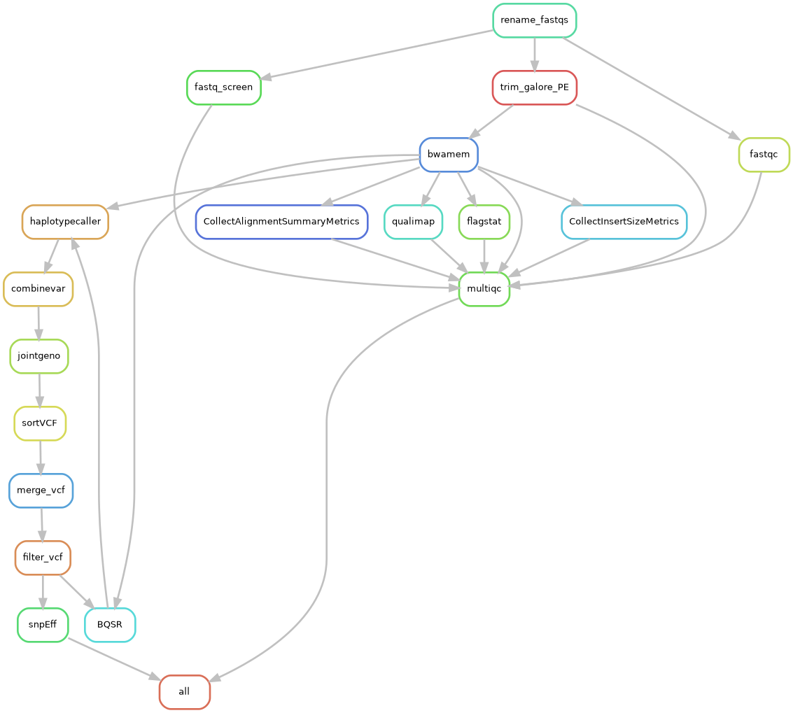

# Variant calling workflow using GATK4

For now, for simplicity, we assume that each sample is a 'platform unit'.

# Usage

1. Fill out/Edit the `config.yaml` file.

2. Make samplesheet. You can go to the `bin/` folder and run `bash make_samples_template.sh`.

3. A file named `grouped_contigs.tsv` with a column named 'name' and a second column named 'contigs' containing comma-delimited sequence names (chromosome/contig names) is needed. You may run `Rscript group_contigs.R`.

4. `sbatch -p bbc bin/run_snakemake.sh`. 

# Workflow

 
